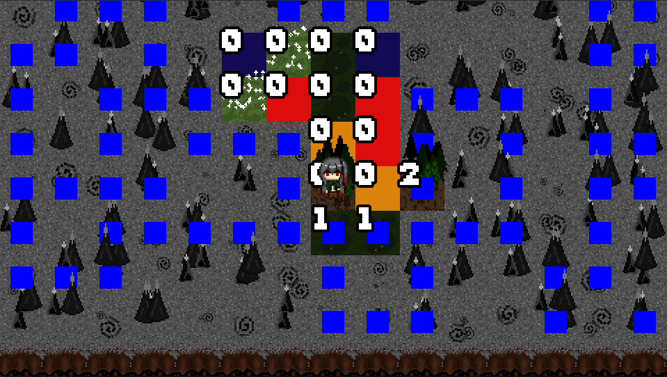

# Intro
- Hello, and welcome to my GitHub.
- You will find my many programming projects here.
- I mostly make games, but I have been know to do some other stuff.
- I personally use c++ and SFML to make games, but I have experience using c# and Unity.
- I also enjoy 8 bit art and working on my car.
- I started to make some simple games with JS / TS / HTML, check them out here! -> [lordplatypus.github.io](https://lordplatypus.github.io)

### Some Stats
---
> 

### Current Project(s)
---
 > - Monster Sweeper -> Mine Sweeper but with dungeon crawling / rougelike aspecs
 > 

<!-- >  -->

<!-- ### Game Base
---
>  -->

### Noteworthy / finished games
---
> 

> 
> - [Video](https://drive.google.com/file/d/1_wkeOdnAibiDZWL2C8fwjAJCqUuMiXXe/view?usp=sharing)

 

> 

### HTML5 / JavaScript / TypeScript
---
> 

> 

### Unity
---
 
 

> 
> - [Video](https://drive.google.com/file/d/1VaWz4vrZLyGXLp2J7o5HSjlnJe3rQKIq/view?usp=sharing)

> 
> - [Video](https://drive.google.com/file/d/1LRiM1Hkz_oKIuju8MFIC-rLnpAIWz4E0/view?usp=sharing)

> - Misc. Unity [videos](https://drive.google.com/drive/folders/13CAJnkv_MCMbHHvUPLvZfhkiuql24qPv?usp=sharing)

### Other non-game projects
---
> 

> 

Thank you for taking a look! 
